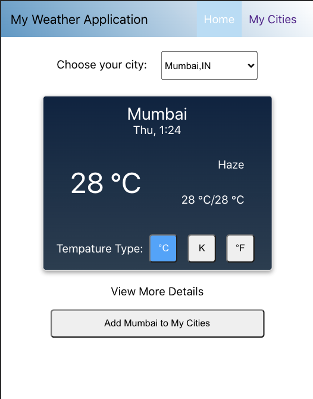

# Indian Weather Application

The following project is a light-weight weather application for select Indian cities. 
This application has been created specifically for [GreyAtom](https://greyatom.com/) to demonstrate application of React + Redux + Firebase.

A special thanks to [OpenWeather](https://openweathermap.org/) for providing extensive, historical, and accurate weather data using light-speed APIs.

 

> *For commericial permissions and legal applications, kindly get in touch with the author - [Rushabh Shah](https://www.linkedin.com/in/rushabh-shah-83869a95/) or [GreyAtom](https://greyatom.com/contact)*

Technologies used: 
- React (for creating web application)
- Redux (for storing and accessing data locally as a store)
- Google Firebase (for storing data on a server)

To use this application,

1. Clone this application to your local machine.
2. Open a terminal of your choice and head to the folder on your local machine where this code is stored.
3. Type `npm install`.
4. Type `npm start`.

